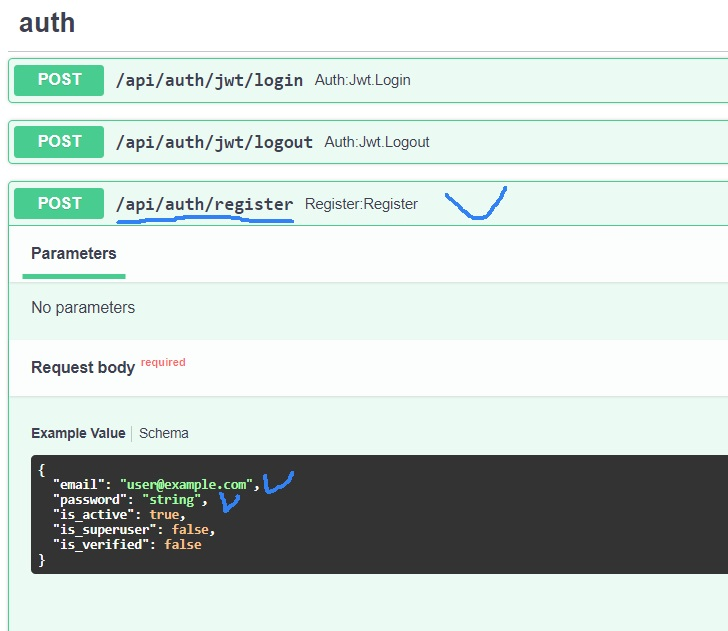

# Tech_accidents

<details>
  <summary>Оглавление</summary>
  <ol>
    <li>
      <a href="#описание">Описание</a>
      <ul>
        <li><a href="#функционал">Функционал</a></li>
        <li><a href="#технологии">Технологии</a></li>
      </ul>
    </li>
    <li>
    <a href="#запуск-приложения-локально">Запуск приложения локально</a>
    </li>
    <li>
      <a href="#для-разработки">Для разработки</a>
      <ul>
        <li><a href="#установка-и-настройка-приложения">Установка и настройка приложения</a></li>
        <li><a href="#запуск">Запуск</a></li>
        <li><a href="#работа-с-poetry">Работа с Poetry</a></li>
      </ul>
    </li>
    <li><a href="#использование">Использование</a></li>
    <li>
      <a href="#примеры-запросов-api">Примеры запросов api</a>
      <ul>
        <li><a href="#регистрация">Регистрация</a></li>
        <li><a href="#авторизация">Авторизация</a></li>
        <li><a href="#смена-пароля">Смена пароля</a></li>
        <li><a href="#фиксация-простоя">Фиксация простоя</a></li>
        <li><a href="#редактирование-простоя">Редактирование простоя</a></li>
        <li><a href="#аналитика-простоев">Аналитика простоев</a></li>
        <li><a href="#постановка-задачи">Постановка задачи</a></li>
        <li><a href="#редактирование-задачи">Редактирование задачи</a></li>
        <li><a href="#выданные-задачи">Выданные задачи</a></li>
        <li><a href="#полученные-задачи">Полученные задачи</a></li>
      </ul>
    </li>
   <li><a href="#разработчик">Информация о разработчиках</a></li>
  </ol>
</details>

## Описание

Веб-приложение для учета и фиксации простоев в бизнес-процессах в управляющей
компании инвестиционных фондов, включая менеджер задач, а также  модуль учета
и управления рисками.

Приложение позволяет фиксировать сбои в бизнес-процессах УК ПИФ, в соответствии
с требованиями Положения Банка России от 15.11.2021 N 779-П "Об установлении 
обязательных для некредитных финансовых организаций требований к операционной 
надежности ..., в целях обеспечения непрерывности оказания финансовых услуг".

Приложение в автоматическом режиме фиксирует отсутствие доступа в интернет,
позволяет пользователям вносить случаи простоя, изменять их, получать аналитику 
за выбранный период времени.

Пользователи также могут ставить задачи другим пользователям, изменять и дополнять
их по мере реализации.

### Функционал

#### Модуль фиксации случаев простоя:
- Автоматическая фиксация и запись в базу данных случаев простоя при отсутствии доступа в интернет;
- Авторизация и разграничение прав доступа пользователей;
- Возможность добавления случаев простоя и их редактирование пользователями;
- Получение аналитики по простоям за период: количество, сумма, максимальный простой и т.п.
- Юзер-френдли интерфейс работы приложения с использованием форм ввода данных;
- Соответствие требованиям N 779-П по защите и разграничению прав доступа;
- Доступ только из локальной сети Организации и отсутствие доступа из вне;
- Автоматический бэкап базы данных.

#### Модуль постановки и управления задач:
-	Пользователи могут ставить друг другу задачи и сроки их реализации;
-	Контроль сроков реализации задач и дедлайнов;
-	Централизованное хранение задач в базе данных;
-	Получение аналитики по выставленным и полученным задачам по каждому пользователю;

### Технологии

[![Python][Python-badge]][Python-url]
[![FastAPI][FastAPI-badge]][FastAPI-url]
[![SQLite][SQLite-badge]][SQLite-url]
[![Docker][Docker-badge]][Docker-url]

## Запуск приложения локально
<details>
 <summary><h3></h3></summary>

1. Создайте и заполните файл `.env`:

    ```dotenv
   # Переменные приложения
   SLEEP_TEST_CONNECTION=20  # Интервал доступа к Интернет (сек.)
   SECRET_KEY=  # Cекретный ключ для генерации jwt-токенов

   # Переменные базы данных
   MAX_DB_BACKUP_FILES=50  # Максимальное количество файлов бэкапа БД
   SLEEP_DB_BACKUP=43200  # Интервал архивирования БД в сек (12 ч.)
   DATABASE_NAME=tech_accident_db_local.db  # Имя БД
   
   # Настройки логирования
   LOG_LEVEL=INFO  # Уровень логирования
   LOG_DIR=logs  # Директория для сохранения логов. По умолчанию - logs в корневой директории
   LOG_FILE=app.log  # Название файла с логами
   LOG_FILE_SIZE=10485760  # Максимальный размер файла с логами, в байтах
   LOG_FILES_TO_KEEP=5  # Количество сохраняемых файлов с логами

   # Настройки используемых тех.процессов
   TECH_PROCESS={"DU_25": "25", "SPEC_DEP_26": "26", "CLIENTS_27": "27"}
   
   # Настройки угроз
   RISK_SOURCE="{\"ROUTER\": \"Риск инцидент: сбой в работе рутера.\",
   \"EQUIPMENT\": \"Риск инцидент: отказ оборудования.\",
   \"BROKER\": \"Риск инцидент: на стороне брокер.\",
   \"PO\": \"Риск инцидент: ПО.\",
   \"PROVAIDER\": \"Риск инцидент: сбой на стороне провайдер.\",
   \"ANOTHER\": \"Иное\"}"
   
   # Настройки персонала для постановки задач 
   # (вставить строку из эндпоинта /api/users и разбить по указанному примеру)
   STAFF="{\"1\": \"user@example.com\", \"2\": \"auto@example.com\",
    \"3\": \"true2@example.com\", \"4\": \"user5@example.com\",
     \"5\": \"test_user_ex@example.com\", \"6\": \"user54378@example.com\"}"
    ```

    > **Note**
   > [Полный пример переменных окружения](env.example).

2. Собрать и запустить контейнеры из файла infra/docker-compose.local.yml.

    ```shell
    docker compose -f infra/docker-compose.local.yml up
    ```
    Эта команда создаст и запустит контейнер бэкэнда.


4. После успешного запуска контейнеров, выполните следующую команду, которая войдет в контейнер, выполнит миграции и наполнит тестовую базу данных:

    ```shell
    docker exec -it procharity_bot_backend sh -c "alembic upgrade head && python3 fill_db.py"
    ```
</details>

## Для разработки

<details>
  <summary><h3>Установка и настройка приложения</h3></summary>

1. Клонировать репозиторий.

    ```shell
    git clone https://github.com/ArtemBalandin81/tech_accidents.git
    cd tech_accidents
    ```

2. Установить зависимости и активировать виртуальное окружение.

    ```shell
    poetry env use python3.11
    poetry install
    poetry shell
    ```

    > **Note**
   > [Документация по установке Poetry](https://python-poetry.org/docs/#installation)

3. Создайте и заполните файл `.env`:
    > **Note**
   > [Полный пример переменных окружения](env.example).
</details>


<details>
  <summary><h3>Запуск</h3></summary>
1. Запустить Docker с БД.

    ```shell
    sudo docker compose -f infra/docker-pg.yml up -d
    ````

2. Применить миграции базы данных.

    ```shell
    alembic upgrade head

3. Выполнить скрипт наполнения тестовой базы.

    ```shell
    python3 fill_db.py
    ```

4. Запустить сервер приложения.

    ```shell
    uvicorn src:app --port 8001 --reload
    ```
</details>


<details>
  <summary><h3>Работа с Poetry</h3></summary>

В этом разделе представлены наиболее часто используемые команды.

Подробнее: https://python-poetry.org/docs/cli/

1. Настройка окружения проекта
Установку необходимо выполнять через curl, как в документации.

    ```shell
    poetry env use python3.11; poetry install
    ```

2. Активировать виртуальное окружение

    ```shell
    poetry shell
    ```

3. Добавить зависимость

    ```shell
    poetry add <package_name>
    ```

    > **Note**
   > Использование флага `--dev (-D)` позволяет установить зависимость,
   > необходимую только для разработки.
   > Это полезно для разделения develop и prod зависимостей.

#### Запустить скрипт без активации виртуального окружения

```shell
poetry run <script_name>.py
```
</details>


## Использование

После выполнения инструкций, описанных в разделе "[Для разработки](#для-разработки)",

будет запущен FastAPI-сервер по адресу http://localhost:8001.

Также по адресу http://localhost:8001/docs доступна полная документация API.

## Примеры запросов api

Данный раздел содержит примеры использования Приложения.
Настоятельно рекомендуем каждому прочитать его хотя бы один раз.
> **Note**
   > [Интерактивная инструкция](Tech_accidents_readme.docx).


### Регистрация
<details>
  <summary><h3></h3></summary>
  1. Запустить приложение: 
  <a href="#">http://127.0.0.1:8001/docs#/auth/register_register_api_auth_register_post</a>
  
  

</details>

### Авторизация
<details>
  <summary><h3></h3></summary>

</details>


### Смена пароля
<details>
  <summary><h3></h3></summary>

</details>


### Фиксация простоя
<details>
  <summary><h3></h3></summary>

</details>


### Редактирование простоя
<details>
  <summary><h3></h3></summary>

</details>


### Аналитика простоев
<details>
  <summary><h3></h3></summary>

</details>


### Постановка задачи
<details>
  <summary><h3></h3></summary>

</details>


### Редактирование задачи
<details>
  <summary><h3></h3></summary>

</details>


### Выданные задачи
<details>
  <summary><h3></h3></summary>

</details>


### Полученные задачи
<details>
  <summary><h3></h3></summary>

</details>


#### Информация о разработчиках: [Артем Баландин](https://github.com/ArtemBalandin81)


<!-- MARKDOWN LINKS & BADGES -->
[Python-url]: https://www.python.org/
[Python-badge]: https://www.python.org/static/community_logos/python-powered-w-70x28.png

[FastAPI-url]: https://fastapi.tiangolo.com/
[FastAPI-badge]: https://img.shields.io/badge/FastAPI-005571?style=for-the-badge&logo=fastapi

[SQLite-url]: https://www.sqlite.org/
[SQLite-badge]: https://img.shields.io/badge/sqlite-%2307405e.svg?style=for-the-badge&logo=sqlite&logoColor=white

[Docker-url]: https://www.docker.com/
[Docker-badge]: https://img.shields.io/badge/docker-%230db7ed.svg?style=for-the-badge&logo=docker&logoColor=white

[Postgres-url]: https://www.postgresql.org/
[Postgres-badge]: https://img.shields.io/badge/postgres-%23316192.svg?style=for-the-badge&logo=postgresql&logoColor=white
