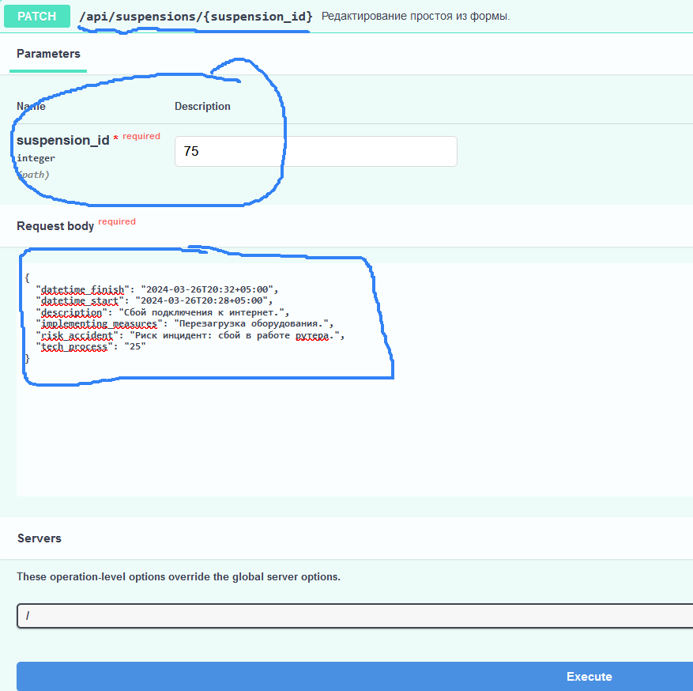

# Tech_accidents

<details>
  <summary>Оглавление</summary>
  <ol>
    <li>
      <a href="#описание">Описание</a>
      <ul>
        <li><a href="#функционал">Функционал</a></li>
        <li><a href="#технологии">Технологии</a></li>
      </ul>
    </li>
    <li>
    <a href="#запуск-приложения-локально">Запуск приложения локально</a>
    <ul>
      <li><a href="#заполнить-переменные-окружения">Заполнить переменные окружения</a></li>
      <li><a href="#развернуть-контейнеры">Развернуть контейнеры</a></li>
      <li><a href="#работа-в-локальной-сети">Работа в локальной сети</a></li>
    </ul>
    </li>
    <li>
      <a href="#для-разработки">Для разработки</a>
      <ul>
        <li><a href="#установка-и-настройка-приложения">Установка и настройка приложения</a></li>
        <li><a href="#запуск">ЗАПУСК</a></li>
        <li><a href="#работа-с-poetry">Работа с Poetry</a></li>
      </ul>
    </li>
    <li><a href="#использование">Использование</a></li>
    <li>
      <a href="#примеры-запросов-api">Примеры запросов api</a>
      <ul>
        <li><a href="#регистрация">Регистрация</a></li>
        <li><a href="#авторизация">Авторизация</a></li>
        <li><a href="#смена-пароля">Смена пароля</a></li>
        <li><a href="#фиксация-простоя">Фиксация простоя</a></li>
        <li><a href="#редактирование-простоя">Редактирование простоя</a></li>
        <li><a href="#мои-случаи-простоев">Мои случаи простоев</a></li>
        <li><a href="#аналитика-простоев">Аналитика простоев</a></li>
        <li><a href="#постановка-задачи">Постановка задачи</a></li>
        <li><a href="#редактирование-задачи">Редактирование задачи</a></li>
        <li><a href="#описание-задачи">Описание задачи</a></li>
        <li><a href="#выданные-задачи">Выданные задачи</a></li>
        <li><a href="#полученные-задачи">Полученные задачи</a></li>
      </ul>
    </li>
   <li><a href="#разработчики">Разработчики</a></li>
  </ol>
</details>

## Описание

Веб-приложение для учета и фиксации простоев в бизнес-процессах управляющей
компании инвестиционных фондов, включая менеджер задач, а также  модуль учета
и управления рисками* (*в разработке).

Приложение позволяет фиксировать сбои в бизнес-процессах НФО (участника фондового рынка),
в соответствии с требованиями Положения Банка России от 15.11.2021 N 779-П "Об установлении 
обязательных для некредитных финансовых организаций требований к операционной 
надежности ..., в целях обеспечения непрерывности оказания финансовых услуг".

Приложение автоматически фиксирует в БД отсутствие доступа в интернет, позволяет пользователям 
фиксировать случаи простоя, вносить в них изменения, получать аналитику за выбранный период времени.

Пользователи также могут ставить задачи другим пользователям, изменять и дополнять
их по мере реализации.

Все случаи простоя и задачи можно дополнить уточняющими файлами. Реализована возможность их выгрузки,
редактирования, удаления и т.п.

### Функционал

#### Модуль фиксации случаев простоя:
- Автоматическая фиксация и запись в базу данных случаев простоя при отсутствии доступа в интернет;
- Авторизация и разграничение прав доступа пользователей;
- Возможность добавления случаев простоя и их редактирование пользователями;
- Получение аналитики по простоям за период: количество, сумма, максимальный простой и т.п;
- Интерфейс работы приложения с использованием форм ввода данных (с помощью swagger);
- Соответствие требованиям N 779-П по защите и разграничению прав доступа;
- Доступ только из локальной сети Организации и отсутствие доступа из вне;
- Прикрепление к случаям простоя дополнительных материалав, управление файлами, их удаление.- 

#### Модуль постановки и управления задач:
- Пользователи могут ставить друг другу задачи и сроки их реализации;
- Прикрепление к задачам дополнительных материалав, управление файлами, их удаление.
- Контроль сроков реализации задач и дедлайнов;
- Централизованное хранение задач и прикрепленных файлов в базе данных;
- Получение аналитики по выставленным и полученным задачам по каждому пользователю.

#### Сервисные функции:
- Автоматический бэкап базы данных;
- Загрузка файлов в каталог с файлами, анализ "бесхозных" файлов и их удаление.

### Технологии

Приложение построено на принципах `чистой архитектуры`

[![Python][Python-badge]][Python-url]
[![FastAPI][FastAPI-badge]][FastAPI-url]
[![SQLite][SQLite-badge]][SQLite-url]
[![Docker][Docker-badge]][Docker-url]


<details>
  <summary><h3>Принципы чистой архитектуры</h3></summary> 
   
    Приложение строится на принципах чистой архитектуры.
    Чистая архитектура имеет множество разновидностей,
    но любая из них включает в себя 3 слоя (уровня): 
    
    - представления (API router, bot handlers)
    - бизнес-логики (services)
    - данных (repository).

  Это позволяет упростить внесение изменений в код, поскольку сразу понятно в каком слое, какие изменения нужно производить.

  Функции отдельных слоев в разрабатываемом приложении:

  1. Слой **представления** занимается:
     - Получением входных данных.
     - Передачей их в слой бизнес-логики и преобразованием в нужный формат при формировании ответа.
     - Валидацией данных только на наличие значений и правильный их формат (с помощью - Pydantic).
     - Форматированием выходных данных и определением в каком виде отдать данные получателю,
       (например, json для API или html для стандартной страницы, или какие кнопки прикрепить к сообщению в боте).


  2. Слой **бизнес-логики (services)** отвечает за:
     - Исполнение требований диктуемых заказчиком.
     - Валидацию бизнес правил.
       > **Note**
       > 
       > Разница между валидацией представления и валидацией бизнес-логики в том, что первая отвечает за наличие данных,
       а вторая за валидность их в той или иной ситуации.

     - Получение данных из слоя данных.
     - Формирование необходимых выходных данных.     - 
     
     Для получения или сохранения данных *(из базы данных, стороннего сервиса, API, ..)* из бизнес-уровня,
     необходимо использовать репозитории.


  3. Слой **данных (repository)** отвечает за:
     - получение и сохранение данных в базе данных или сторонних сервисах.
       > **Note**
       > 
       > Делать это за пределами уровня данных запрещено! 
       > 
       > Для получения данных из БД используется паттерн Репозиторий.
       > 
       > Он содержит как стандартные методы для получения данных по id, так и специализированные, 
       для получения сложных сущностей.

  Разделение логики приложения на несколько слоёв позволяет отделить бизнес-правила
  от логики и способа хранения данных или отображения их пользователям. 
</details>

<summary><h2>Запуск приложения локально</h2></summary>
Запуск приложения локально в доккер-контейнере.


<details>
  <summary><h3>Заполнить переменные окружения</h3></summary>

1. Создать и заполнить файл `.env`:

    ```dotenv
    # Общие настройки приложения
    APP_TITLE=Учет фактов простоя ИС
    APP_DESCRIPTION=Журнал учета фактов простоя информационной системы УК ПИФ
    CONNECTION_TEST_URL_BASE=https://www.agidel-am.ru  # Базовый url теста доступа в интернет
    CONNECTION_TEST_URL_2=https://www.ya.ru  # Дополнительный url теста доступа в интернет
    FILES_DOWNLOAD_DIR=uploaded_files  # Каталог для хранения дополнительных файлов, прикрепленных к задачам и простоям
    FILE_TYPE_DOWNLOAD=("doc", "docx", "xls", "xlsx", "img", "png", "txt", "pdf", "jpeg")
    MAX_FILE_SIZE_DOWNLOAD=10000  # Максимальный допустимый к загрузке размер файла в кб
    SLEEP_TEST_CONNECTION=20  # Интервал тестирования доступа к Интернет в секундах
    TIMEZONE_OFFSET=5  # Часовой пояс
    TOKEN_AUTH_LIFETIME_SEC=432000  # Срок жизни токена авторизации в секундах (60*60*24*5)


    # Переменные приложения
    SECRET_KEY=  # Cекретный ключ для генерации jwt-токенов

    # Переменные базы данных
    DB_BACKUP=False  # Включение(True) | Выключение(False) режим авто архивирования БД
    DB_BACKUP_DIR=db_backups # Название каталога для хранения архивов БД
    MAX_DB_BACKUP_FILES=50  # Максимальное количество файлов бэкапа БД
    SLEEP_DB_BACKUP=43200  # Интервал архивирования БД в сек (12 ч.)
    DATABASE_NAME=tech_accident_db_local.db  # Имя БД
    DATABASE_URL=sqlite+aiosqlite:///./tech_accident_db_local.db

    # Настройки логирования
    LOG_LEVEL=INFO  # Уровень логирования
    LOG_DIR=logs  # Директория для сохранения логов. По умолчанию - logs в корневой директории
    LOG_FILE=app.log  # Название файла с логами
    LOG_FILE_SIZE=10485760  # Максимальный размер файла с логами, в байтах
    LOG_FILES_TO_KEEP=5  # Количество сохраняемых файлов с логами

    # Настройки используемых тех.процессов
    INTERNET_ACCESS_TECH_PROCESS=25  # Наиболее критический к отсутствию доступа в Интернет ТП в Организации 
    TECH_PROCESS={"DU_25": "25", "SPEC_DEP_26": "26", "CLIENTS_27": "27"}

    # Настройки угроз
    RISK_SOURCE="{\"ROUTER\": \"Риск инцидент: сбой в работе рутера.\",
    \"EQUIPMENT\": \"Риск инцидент: отказ оборудования.\",
    \"BROKER\": \"Риск инцидент: на стороне брокер.\",
    \"PO\": \"Риск инцидент: ПО.\",
    \"PROVAIDER\": \"Риск инцидент: сбой на стороне провайдер.\",
    \"ANOTHER\": \"Иное\"}"

    # Настройки персонала для постановки задач 
    # (вставить строку из эндпоинта /api/users и разбить по указанному примеру)
    BOT_USER=2  # "id" бота, от имени которого фиксируются простои в автоматическом режиме
    STAFF="{\"1\": \"user@example.com\", \"2\": \"auto@example.com\",
    \"3\": \"true2@example.com\", \"4\": \"user5@example.com\",
     \"5\": \"test_user_ex@example.com\", \"6\": \"user54378@example.com\"}"
    ```

   > **Note**
   > 
   > [Полный пример переменных окружения](env.example).

   > **Note**
   > 
   > Для наполнения переменной `STAFF` в файле `.env` списком `e-mail` пользователей необходимо:
   > - выбрать эндпоинт [GET/api/users](http://localhost:8001/docs#/users/get_all_active_api_users_get)
   > под правами админа
   > 
   > - Скопировать строковое представление пользователей и вставить его в переменную `STAFF` в файле `.env`:
   > >`STAFF="{\"1\": \"user@example.com\", \"2\": \"auto@example.com\", \"3\": \"true2@example.com\"}"` 

   > **Note**
   > 
   > Кастомизировать настройки проекта можно также в файле `src/api/constants.py`

</details>

<details>
  <summary><h3>Развернуть контейнеры</h3></summary>

2. Перед запуском контейнеров убедиться, что в проекте `"рабочие миграции"`:
   > **Note**
   > 
   > - Если возникает ошибка миграций, необходимо удостовериться, что директория с миграциями пуста!!!;
   >   `C:\...\tech_accidents\src\core\db\migrations\versions` 
   > - Если миграции в ней есть - очистить директорию от миграций.
   > - Если миграций нет, необходимо запустить `автогенерацию миграций`:
   >  `alembic revision --autogenerate -m "first_migration"`

3. При наличии "рабочих миграций" - можно собрать и запустить контейнеры из файла `infra/docker-compose.local.yml`. 
Эта команда создаст и запустит контейнер бэкэнда.
   > **Note**
   > 
   > Перед запуском контейнеров необходимо убедиться, что нет ранее запущенного контейнера
   > `tech_accidents_backend`. 
   > 
   > Если же он имеется - необходимо перед запуском сборки контейнера
   > удалить прежний контейнер `tech_accidents_backend` и его образ!

    ```shell
    docker compose -f infra/docker-compose.local.yml up
    ```
   > **Note**
   > 
   > После успешного запуска контейнера, можно проверить работу приложения на тестовом эндпоинте:
   > 1. Выбрать тестовый эндпоинт проверки доступа к сети интернет: 
   [GET/api/test_get_url](http://localhost:8001/docs#/services/test_get_url_api_test_get_url_get)
   > 
   > 2. Нажать кнопку `Try it out`.
   > 3. Нажать кнопку `Execute`.
   > 4. Убедиться, что получен ответ `200` в теле ответа `Response body`.

4. После успешного запуска контейнеров, выполните следующую команду, которая войдет в контейнер и выполнит миграции:
   > **Note**
   > 
   > Перед выполнением следующей команды необходимо убедиться, что контейнер запущен.
   > Остановить работу контейнеров в терминале можно сочетанием клавиш `CTRL + C`
   > Команду необходимо выполнять либо в новом терминале, либо запускать контейнер в "десктопной версии" Доккер.
   
    ```shell
    docker exec -it tech_accidents_backend sh -c "alembic upgrade head"
    ```
5. <a href="#запуск">ЗАПУСК</a></li>
</details>

<details>
  <summary><h3>Работа в локальной сети</h3></summary>
  Для запуска приложения в локальной сети необходимо выполнить следующие шаги.

1. Запустить приложение локально в контейнере Docker:
<a href="#запуск-приложения-локально">Запуск приложения локально</a>
   > **Note**
   > 
   > В приложении используется следующий проброс портов в Docker-контейнере:
   >  ```shell
   >  ports:
   >  "8001:8001"
   >  ```
   > Изменить проброс портов Docker-контейнера можно в файле: `infra/docker-compose.local.yml`.

2. Узнать `ip-адрес` "машины", на котором развернуто приложение в контейнере Docker:
- `сеть и Интернет > Ethernet > IPv4-адрес` вида: `192.168.???.??`, например: `192.192.192.92`
- тогда - адрес в браузере для доступа к приложению в локальной сети будет:
- `192.192.192.92:8001/docs#`

</details>


## Для разработки

  Запуск приложения в режиме для разработки.

<details>
  <summary><h3>Установка и настройка приложения</h3></summary>

  1. Клонировать репозиторий.

        ```shell    
        git clone git@github.com:ArtemBalandin81/tech_accidents.git
        cd tech_accidents

  2. Установить зависимости и активировать виртуальное окружение.

        ```shell
        poetry env use python3.11
        poetry shell
        poetry install     

  3. или указать путь до требуемой версии Python311, например:

        ```shell
        poetry env use /C/Users/79129/AppData/Local/Programs/Python/Python311/python.exe     
        poetry shell
        poetry install

  > **Note**
  > 
  > [Документация по установке Poetry](https://python-poetry.org/docs/#installation)

  > **Note**
  > 
  > You can get the path to your Python version by running
  > - `which python3.11` on Linux 
  > - or `py -0p` on Windows.
  
> **Note**
  > 
  > Посмотреть установленные зависимости: `poetry show` 

  4. <a href="#заполнить-env">Заполнить переменные окружения</a>

  > **Note**
  > [Полный пример переменных окружения](env.example).
</details>


<details>
  <summary><h3>ЗАПУСК</h3></summary>

  > **Note**
  > 
  > - Удостовериться, что директория с миграциями пуста!!!;
  >   `C:\...\tech_accidents\src\core\db\migrations\versions` 
  > - Если миграции в ней есть - очистить директорию от миграций.

  1. Применить миграции базы данных.

      ```shell
      alembic revision --autogenerate -m "first_migration"
      alembic upgrade head

  2. Запустить сервер приложения.

      ```shell
      uvicorn src:app --port 8001 --reload
   
  3. Зарегистрировать первого пользователя, например:
      ```shell
      email: user@example.com
      password: string_string

  > **Note**
  > 
  > 1. Выбрать эндпоинт регистрации: 
  [POST/api/auth/register](http://localhost:8001/docs#/users/users_patch_current_user_api_users_me_patch)
  
  > 2. Нажать кнопку `Try it out`.
  > 3. Заполнить `"email"` и `"password"`.
  > 4. Нажать кнопку `Execute`.
  > 5. Удостовериться что получен ответ 200: `"Успешная регистрация"`.

  4. Создать `пользователя-бота` с `id=2` в БД для автоматической фиксации простоев:

      ```shell
      - email: auto@example.com
      - password: string_string
      - id=2
  > **Note**
  > 
  > При отсутствии пользователя-бота `auto@example.com` с `id=2` в БД 
  > возможны ошибки в работе приложения при автоматической фиксации простоев!!!

  5. Удостовериться, что зарегистрированные пользователи появились в БД (например с помощью `dbeaver`).

  

  6. Установить права администратора одному из пользователей в столбце таблицы `is_superuser`
  и применить изменения, нажав кнопку `обновить` в `dbeaver`.

  7. Далее можно работать с приложением, изучив примеры: <a href="#использование">Использование</a>

</details>


<details>
   <summary><h3>Работа с Poetry</h3></summary>
   В этом разделе представлены наиболее часто используемые команды.

   ```shell
      - Активировать среду: poetry shell
      - Деактивировать: exit
      - Установить зависимости из файла: poetry install
      - Обновление пакетов: poetry update (poetry update ABC=1.3.2 BCD=1.2.3)
      - Добавить новую библиотеку: poetry add --dev <package name> 
      (poetry add "pygame>=2" или poetry add pygame@^2)
      - Удалить библиотеку: poetry remove <package name>
      - Посмотреть зависимости: poetry show
      - Generating requirements.txt: poetry export --without-hashes > requirements.txt

   ```

   Подробнее: https://python-poetry.org/docs/cli/

   ### Настройка окружения проекта
   Установку необходимо выполнять через curl, как в документации.

```shell
poetry env use python3.11; poetry install
```

   1. Активировать виртуальное окружение

       ```shell
       poetry shell
       ```

   2. Добавить зависимость

       ```shell
       poetry add <package_name>
       ```

       > **Note**
      > Использование флага `--dev (-D)` позволяет установить зависимость,
      > необходимую только для разработки.
      > Это полезно для разделения develop и prod зависимостей.

   #### Запустить скрипт без активации виртуального окружения

   ```shell
   poetry run <script_name>.py
   ```
</details>


## Использование

После выполнения инструкций, описанных в разделе [Для разработки](#для-разработки),
будет запущен FastAPI-сервер по адресу: http://localhost:8001.

Полная документация API: http://localhost:8001/docs#.

## Примеры запросов api

Данный раздел содержит примеры использования Приложения.
> **Note**
  > 
  > [tech_accidents_readme.docx](tech_accidents_readme.docx).


<details>
  <summary><h3>Регистрация</h3></summary>

  1. Выбрать эндпоинт регистрации: 
  [POST/api/auth/register](http://localhost:8001/docs#/users/users_patch_current_user_api_users_me_patch)
  
  2. Нажать кнопку `Try it out`.
  3. Заполнить `"email"` и `"password"`.
  4. Нажать кнопку `Execute`.
  5. Удостовериться что получен ответ 200: `"Успешная регистрация"`.
</details>


<details>
  <summary><h3>Авторизация</h3></summary>

  1. Войти на главную страницу, или выбрать любой эндпоинт с авторизацией: 
   <a href="#">http://localhost:8001/docs#</a>
   
  2. Нажать кнопку `Autorize` или `замочек` авторизации справа.
  3. Ввести `username` и `password`.

> **Note**
   > 
   > Правами на изменение пароля обладают пользователь в эндпоинте:
   > [PATCH/api/users/me](http://localhost:8001/docs#/users/users_patch_current_user_api_users_me_patch)
   > а также администратор:
   > [PATCH/api/users/{id}](http://localhost:8001/docs#/users/users_patch_current_user_api_users_me_patch)

  4. Удостовериться, что получено подтверждение авторизации
  
</details>


<details>
  <summary><h3>Смена пароля</h3></summary>

  1. Выбрать эндпоинт редактирования текущего пользователя:
   [PATCH/api/users/me](http://localhost:8001/docs#/users/users_patch_current_user_api_users_me_patch)  
   
  2. Нажать кнопку `Try it out`.
  3. Заполнить `"email"` и `"password"`.
  4. Нажать кнопку `Execute`.
  5. Удостовериться что получен ответ `200`.

> **Note**
   >
   > Изменить пароль также может пользователь с правами администратора в эндпоинте:
   > [PATCH/api/users/{id}](http://localhost:8001/docs#/users/users_patch_current_user_api_users_me_patch) 

> **Note**
   >
   > Пароли хранятся в БД в хешированном виде и не доступны для считывания
</details>


<details>
  <summary><h3>Фиксация простоя</h3></summary>

> **Note**
  >
  > Приложение с заданным интервалом в секундах (SLEEP_TEST_CONNECTION) автоматически проверяет
  > наличие доступа к двум адресам в сети интернет и при отсутствии доступа к обоим адресам -
  > заносит простой в БД:


  Зарегистрированный пользователь может занести случай простоя в БД

  1. Пройти авторизацию.
  2. Выбрать эндпоинт создания простоя:   
   [POST/api/suspensions/form](http://localhost:8001/docs#/Suspensions%20POST/create_new_suspension_by_form_api_suspensions_form_post)  
  3. Нажать кнопку `Try it out`.
  4. Заполнить поля формы:
   

   > **Note**
   > 
   > Для изменения источника угроз в форме выбора необходимо:
   > - изменить переменную `RISK_SOURCE` в файле `.env` списком требуемых названий угроз вида:
   > > `RISK_SOURCE="{\"ROUTER\": \"Риск инцидент: сбой в работе рутера.\", \"ANOTHER\": \"Иное\"}"`

   > **Note**
   > 
   > Для изменения тех-процессов в в форме выбора необходимо:
   > - изменить переменную `TECH_PROCESS` в файле `.env` списком требуемых названий техпроцессов вида:
   > > `TECH_PROCESS={"DU_25": "25", "SPEC_DEP_26": "26", "CLIENTS_27": "27"}`   

  5. Нажать кнопку `Execute`.
  6. Удостовериться, что случай простоя записался в БД `получен ответ 200`:
   
  > **Note**
  >
  > - Ответ содержит описание нового случая простоя в формате `json`.
  > - Имеется возможность скопировать данные в буфер обмана, 
  или экспортировать в `файл json`, (открывается любым текстовым редактором).
</details>


<details>
  <summary><h3>Редактирование простоя</h3></summary>
  Зарегистрированный пользователь - как автор простоя - может его редактировать.

> **Note**
  >
  > - Редактирвоание простоя также доступно админу.
  > - Созданный автоматически простой может редактировать только админ.
  > - *** Редактирование простоя через поля формы в разработке.

  1. Пройти авторизацию.
  2. Выбрать эндпоинт редактирования простоя: 
  [PATCH/api/suspensions/{suspension_id}](http://localhost:8001/docs#/Suspensions%20POST/partially_update_suspension_api_suspensions__suspension_id__patch)
  3. Нажать кнопку `Try it out`.
  4. Ввести уникальный номер простоя в БД, который необходимо отредактировать 
  (доступ лишь у автора простоя и админа).
  5. Заполнить json, или поля формы*** (доступ лишь у автора и админа):
   
  6. Нажать кнопку `Execute`.
</details>


<details>
  <summary><h3>Мои случаи простоев</h3></summary>
  Получение случаев простоя, зафиксированных пользователем:

  1. Пройти авторизацию.
  2. Выбрать эндпоинт простоев текущего пользователя: 
    [GET/api/suspensions/my_suspensions](http://localhost:8001/docs#/Suspensions%20GET/get_my_suspensions_api_suspensions_my_suspensions_get)
    
  3. Нажать кнопку `Try it out`.
  4. Нажать кнопку `Execute`.
  5. Удостовериться, что получен список простоев:
    
  > **Note**
  >
  > - Ответ содержит список простоев текущего пользователя в формате `json`, отсортированный по дате добавления.
  > - Позволяет получить все зафиксированные текущим пользователем простои и их `id`.
  > - Имеется возможность скопировать список в буфер обмана, 
  или экспортировать в `файл json`, (открывается любым текстовым редактором).
</details>


<details>
  <summary><h3>Аналитика простоев</h3></summary>

  Анализ простоев за период по всем, или одному из пользователей:

  1. Авторизация не требуется.
  2. Выбрать эндпоинт аналитики простоев: 
    [GET/api/suspensions/analytics](http://localhost:8001/docs#/Suspensions%20ANALYTICS/get_all_for_period_time_api_suspensions_analytics_get)
    
  3. Нажать кнопку `Try it out`.
  4. Задать период по предложенному шаблону ввода данных.
  5. Если оставить поле `«id пользователя»` пустым, будет получена аналитика по всем пользователям
  за выбранный период (или по конкретному пользователю, если указать «id»).
  6. Нажать кнопку `Execute`.
  7. В ответе содержится:
     - Итого минут простоев в периоде;
     - Итого количество простоев за период;
     - Самый длинный простой в периоде;
     - Дата и время последнего по времени простоя;
     - Список простоев за выбранный период:
    
  > **Note**
  >
  > - Ответ содержит аналитику и список простоев текущего пользователя (или всех) в формате `json`,
  > отсортированный по дате добавления.
  > - Позволяет получить все зафиксированные текущим пользователем простои и их `id`.
  > - Имеется возможность скопировать список в буфер обмана, 
  или экспортировать в `файл json`, (открывается любым текстовым редактором).

  > **Note**
  > 
  > Для получения списка `id` и `e-mail` всех пользователей необходимо:
  > - выбрать эндпоинт [GET/api/users](http://localhost:8001/docs#/users/get_all_active_api_users_get)
  > под правами админа
  > 
  > - Нажать кнопку `Try it out`.
  > - Нажать кнопку `Execute` и посмотреть список пользователей вида:
  > `"{\"1\": \"user@example.com\", \"2\": \"auto@example.com\", \"3\": \"true2@example.com\"}"` в ответе эндпоинта.

</details>


<details>
  <summary><h3>Постановка задачи</h3></summary>
  Постановка задачи пользователем (заказчиком задачи) исполнителю.

  1. Пройти авторизацию.
  2. Выбрать эндпоинт постановки задач: 
    [POST/api/tasks/post_task_form](http://localhost:8001/docs#/%D0%97%D0%B0%D0%B4%D0%B0%D1%87%D0%B8%3A%20%D0%BD%D0%B0%D0%B7%D0%BD%D0%B0%D1%87%D0%B8%D1%82%D1%8C%20%D0%B7%D0%B0%D0%B4%D0%B0%D1%87%D1%83/create_new_task_by_form_api_tasks_post_task_form_post)
  3. Нажать кнопку `Try it out`.
  4. Заполнить поля формы:
    

  > **Note**
  > 
  > К задаче можно прикреплять `файлы` с уточняющей информацией. Допустимый формат и размер файлов задается
  > в настройках проекта. 
  > 
  > Файлы можно добавить с использованием двух эндпоинтов: 
  > - [POST/api/tasks/post_task_form](http://localhost:8001/docs#/%D0%97%D0%B0%D0%B4%D0%B0%D1%87%D0%B8%3A%20%D0%BD%D0%B0%D0%B7%D0%BD%D0%B0%D1%87%D0%B8%D1%82%D1%8C%20%D0%B7%D0%B0%D0%B4%D0%B0%D1%87%D1%83/create_new_task_by_form_api_tasks_post_task_form_post) 
  > позволяет добавить задачу и 1 `необязательный (опциональный)` файл, прикрепленный к ней.
  > - [POST/api/tasks/post_task_with_files_form](http://localhost:8001/docs#/%D0%97%D0%B0%D0%B4%D0%B0%D1%87%D0%B8%3A%20%D0%BD%D0%B0%D0%B7%D0%BD%D0%B0%D1%87%D0%B8%D1%82%D1%8C%20%D0%B7%D0%B0%D0%B4%D0%B0%D1%87%D1%83/create_new_task_by_form_with_files_api_tasks_post_task_with_files_form_post) 
  > позволяет добавить задачу и 1 или несколько `обязательных файлов`, прикрепленный к ней
  

  > **Note**
  > 
  > Для наполнения переменной `STAFF` в файле `.env` списком `e-mail` пользователей необходимо:
  > - выбрать эндпоинт [GET/api/users](http://localhost:8001/docs#/users/get_all_active_api_users_get)
  > под правами админа
  > 
  > - Скопировать строковое представление пользователей и вставить его в переменную `STAFF` в файле `.env`:
  > >`STAFF="{\"1\": \"user@example.com\", \"2\": \"auto@example.com\", \"3\": \"true2@example.com\"}"` 

  > **Note**
  > 
  > Если новый исполнитель зарегистрировался в БД, но его еще нет в полях выбора формы 
  > можно задать его `e-mail` в поле `Почта исполнителя не из списка`

  > **Note**
  > 
  > Для изменения тех-процессов в форме выбора необходимо:
  > - изменить переменную `TECH_PROCESS` в файле `.env` списком требуемых названий техпроцессов вида:
  > > `TECH_PROCESS={"DU_25": "25", "SPEC_DEP_26": "26", "CLIENTS_27": "27"}`
   
  7. Нажать кнопку `Execute`.
  8. Удостовериться, что задача была записана в БД `получен ответ 200`!
  > **Note**
  >
  > - Ответ содержит описание новой задачи в формате `json`.
  > - Имеется возможность скопировать данные в буфер обмана, 
  или экспортировать в `файл json`, (открывается любым текстовым редактором).
</details>


<details>
  <summary><h3>Редактирование задачи</h3></summary>
  Редактирование задачи пользователем (заказчиком задачи), или админом.

  1. Пройти авторизацию.
  2. Выбрать эндпоинт редактирования задачи: 
    [PATCH/api/tasks/{task_id}](http://localhost:8001/docs#/%D0%97%D0%B0%D0%B4%D0%B0%D1%87%D0%B8%3A%20%D0%BD%D0%B0%D0%B7%D0%BD%D0%B0%D1%87%D0%B8%D1%82%D1%8C%20%D0%B7%D0%B0%D0%B4%D0%B0%D1%87%D1%83/partially_update_task_by_form_api_tasks__task_id__patch)
  
  3. Нажать кнопку `Try it out`.
  4. Ввести уникальный номер задачи в БД, которую необходимо отредактировать.
  > **Note**
  >
  > - Доступ лишь у заказчика задачи и админа;
  > - Уникальный номер задачи можно получить в эндпоинте выданных пользователем задач:
  > [GET/api/tasks/my_tasks_ordered](http://localhost:8001/docs#/Tasks%20GET/get_my_tasks_ordered_api_tasks_my_tasks_ordered_get)
  
  5. Заполнить поля формы и отметить, выполнена ли задача
  > **Note**
  >
  > - `«True»` - выполнена, `«False»` - еще в работе.
  > - Если поля не заполнять, они останутся прежними.
  >- К задаче можно прикрепить новый файл, или не прикреплять.
  > Чтобы добавить несколько файлов - необходимо редактировать задачу несколько раз.
  > - В случае выбора `«Удалить все прикрепленные файлы»`, все дополнительные файлы, прикрепленные к задаче,
  > будут удалены безвозвратно как из БД, так и физически из каталога файлов.
  

  6. Нажать кнопку `Execute`.
  7. Удостовериться, что задача отредактирована: 
  > **Note**
  >
  > - Ответ содержит описание отредактированной задачи в формате `json`.
  > - Имеется возможность скопировать данные в буфер обмана, 
  или экспортировать в `файл json`, (открывается любым текстовым редактором).
</details>


<details>
  <summary><h3>Описание задачи</h3></summary>
  Подробное описание задачи, с возможностью получения прикрепленных к ней файлов.
  
  1. Пройти авторизацию.
  2. Выбрать эндпоинт выданных пользователем задач: 
    [GET/api/tasks/{task_id}](http://127.0.0.1:8001/docs#/Задачи%3A%20посмотреть%20задачи/get_task_by_id_api_tasks__task_id__get)
  
  3. Нажать кнопку `Try it out`.
  4. Выбрать формат отображения: `json` или `files` (дополнительно нажать `download_file`).
  5. Нажать кнопку `Execute`.
  > **Note**
  >
  > - Ответ содержит подробное описание о задаче в формате `json`.
  > - Имеется возможность скопировать данные в буфер обмана, 
  или экспортировать в `файл json`, (открывается любым текстовым редактором).
  > - В случае выбора опции `files` будет предложено загрузить прикрепленные к задаче файлы в `zip-архиве`.
  > 
</details>


<details>
  <summary><h3>Выданные задачи</h3></summary>
  Список задач, выданных пользователем.
  
  1. Пройти авторизацию.
  2. Выбрать эндпоинт выданных пользователем задач: 
    [GET/api/tasks/my_tasks_ordered](http://localhost:8001/docs#/%D0%97%D0%B0%D0%B4%D0%B0%D1%87%D0%B8%3A%20%D0%BF%D0%BE%D1%81%D0%BC%D0%BE%D1%82%D1%80%D0%B5%D1%82%D1%8C%20%D0%B7%D0%B0%D0%B4%D0%B0%D1%87%D0%B8/get_my_tasks_ordered_api_tasks_my_tasks_ordered_get)
  
  3. Нажать кнопку `Try it out`.
  4. Нажать кнопку `Execute`.
  > **Note**
  >
  > - Ответ содержит отстортированный по сроку исполнения
  > список выданных пользователем еще нерешенных задач в формате `json`.
  > - Имеется возможность скопировать данные в буфер обмана, 
  или экспортировать в `файл json`, (открывается любым текстовым редактором).
</details>


<details>
  <summary><h3>Полученные задачи</h3></summary>
  Список задач, полученных пользователем.
  
  1. Пройти авторизацию.
  2. Выбрать эндпоинт полученных пользователем задач: 
    [GET/api/tasks/my_tasks_todo](http://127.0.0.1:8001/docs#/Задачи%3A%20посмотреть%20задачи/get_my_tasks_todo_api_tasks_my_tasks_todo_get)
  
  3. Нажать кнопку `Try it out`.
  4. Нажать кнопку `Execute`.
  > **Note**
  >
  > - Ответ содержит отстортированный по сроку исполнения
  > список полученных пользователем еще нерешенных задач в формате `json`.
  > - Имеется возможность скопировать данные в буфер обмана, 
  или экспортировать в `файл json`, (открывается любым текстовым редактором).
</details>


### Разработчики
  [Артем Баландин](https://github.com/ArtemBalandin81)


<!-- MARKDOWN LINKS & BADGES -->
[Python-url]: https://www.python.org/
[Python-badge]: https://www.python.org/static/community_logos/python-powered-w-70x28.png

[FastAPI-url]: https://fastapi.tiangolo.com/
[FastAPI-badge]: https://img.shields.io/badge/FastAPI-005571?style=for-the-badge&logo=fastapi

[SQLite-url]: https://www.sqlite.org/
[SQLite-badge]: https://img.shields.io/badge/sqlite-%2307405e.svg?style=for-the-badge&logo=sqlite&logoColor=white

[Docker-url]: https://www.docker.com/
[Docker-badge]: https://img.shields.io/badge/docker-%230db7ed.svg?style=for-the-badge&logo=docker&logoColor=white

[Postgres-url]: https://www.postgresql.org/
[Postgres-badge]: https://img.shields.io/badge/postgres-%23316192.svg?style=for-the-badge&logo=postgresql&logoColor=white
